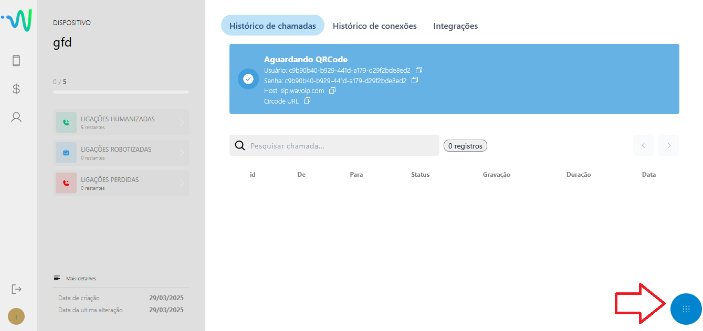
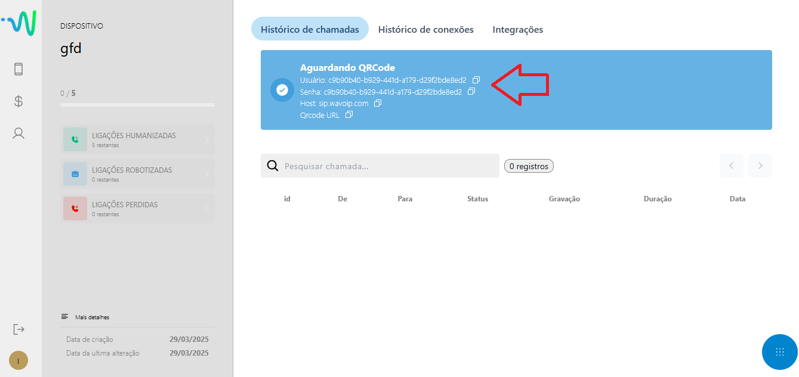
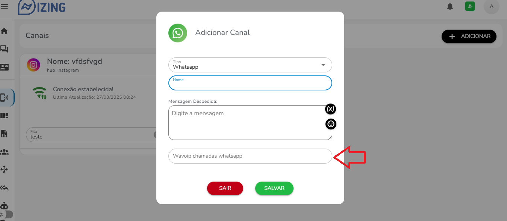

## Como Configurar Wavoip

### Passo a Passo

1. **Acesse o site da Wavoip**  
   - Visite [app.wavoip.com](https://app.wavoip.com/).  
   - Faça o cadastro e realize o login.

2. **Adicione um dispositivo**  
   - Após o login, escolha a opção para adicionar um dispositivo.  

3. **Escaneie o QR Code**  
   - Clique no ícone no canto inferior esquerdo para escanear o QR Code.  
     

4. **Copie o Usuário ou a Senha**  
   - Os dois valores serão iguais. Basta copiá-los.  
     

5. **Acesse a lista de canais**  
   - Localize o canal desejado na lista disponível.

6. **Edite as configurações do canal**  
   - Cole o Usuário ou Senha no campo apropriado.  
   - Em seguida, clique em "Salvar".  
     

7. **Para realizar uma ligação**  
   - Abra um ticket e você verá o botão de telefone na parte superior do ticket. Clique nele para iniciar a ligação.

---

### Dica Especial  
- Aproveite o cupom de desconto **50% OFF** ao utilizar o código abaixo:

```bash
whazing
```