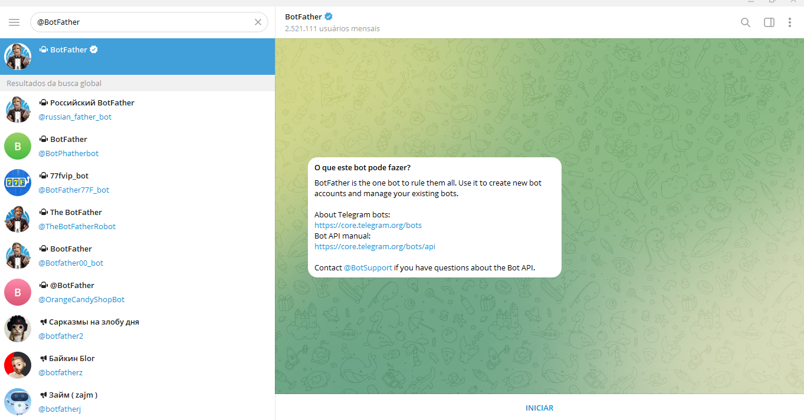
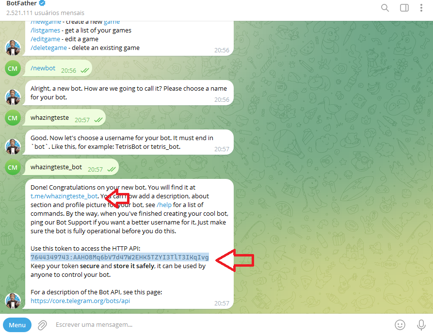

# **Guia de Conexão do TELEGRAM**

1. **Acesse o Telegram**  
   - Faça login em sua conta ou crie uma nova, caso ainda não possua.

2. **Localize o BotFather**  
   - No campo de pesquisa, digite `@BotFather` e acesse esse bot oficial.  
   - Bots oficiais do Telegram possuem um visto azul ao lado de seu nome.  

   

3. **Ative o BotFather**  
   - Clique no botão **Iniciar** para ativar o chatbot BotFather.  
   - Você receberá uma lista de comandos disponíveis para gerenciar bots.

4. **Crie um novo bot**  
   - Digite ou selecione o comando `/newbot` e envie.  
   - Escolha um nome para o seu bot (será exibido para os seus assinantes).  
   - Defina um nome de usuário único para o bot, que deve terminar com **“bot”**.  
     - **Exemplo:** `izing_bot`.

5. **Finalize a criação**  
   - Após escolher o nome, seu bot será criado.  
   - Você receberá:  
     - Um link para o bot no formato: `t.me/<bot_username>`  
     - Recomendações para personalizar imagem de perfil, descrição e comandos do bot.  

6. **Obtenha o token do bot**  
   - Para conectar seu bot à Izing, copie o valor do token fornecido.  
   - Use esse token para cadastrar o canal na Izing.  

   
   
OBS. **As mensagens devem ser enviadas para o bot que você criou, para aparecer no izing**